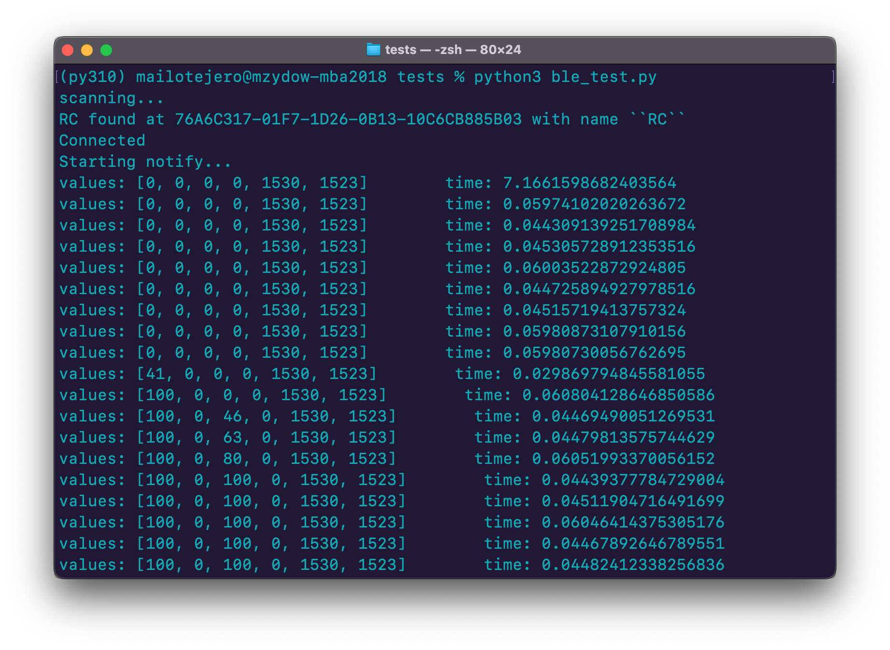
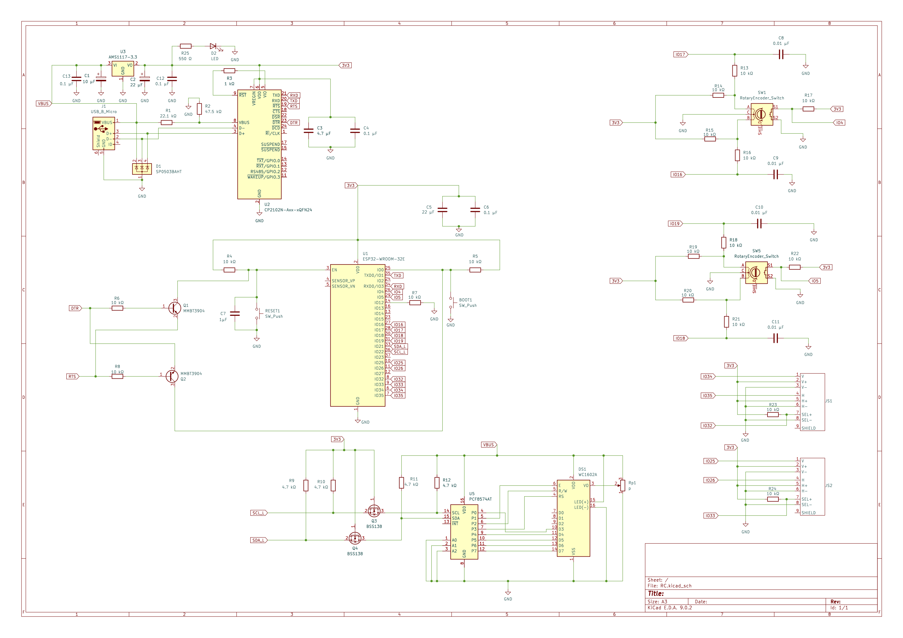
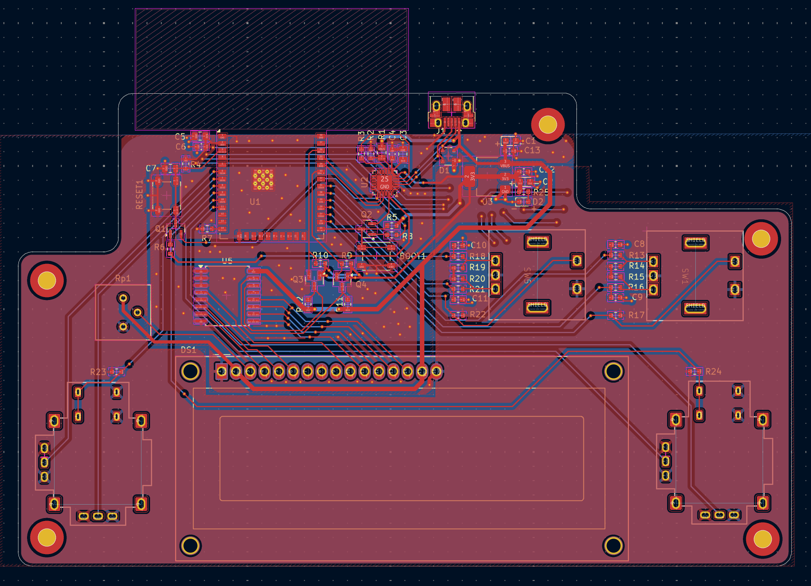

<p align="center">

</p>

This remote control is designed to send incremental inputs over Bluetooth Low Energy. In this specific application, steering and throttle values are set with the rotary encoders and the x and y values of the joysticks are set in a range of -100 to 100. All of these values are sent as a package over BLE.
Running the ```ble_test.py``` shows the unpacked messages being received as shown below. 

<p align="center">

</p>

# ESP-IDF
The file architecture is split into each of the remote's functions with each ```.c``` file also havng a complementary ```.h``` file allowing variable and function sharng across the project.
The files can be found in ```BLE_Remote_Control/main```:
```
config.c
joystick.c
bluetooth.c
encoder.c
lcd.c
buttons.c
main.c
```
```config.c```      Sets up and names the GPIO's used on the ESP32. <br>
```joystick.c```    Reads ADC values from the joystick potentiometers, estimates offsets, and converts the values into a range from -100 to 100. <br>
```bluetooth.c```  Uses NimBLE to run the ESP32 as a server by advertising through a GAP and publishing data packets through a GATT at 50 Hz. <br>
```encoder.c```     Sets up interrupts on quadrature encoders A and B terminals with tasks for counting which are added to queues. <br>
```lcd.c ```        Handles communication with LCD 16x02 via I<sup>2</sup>C. Transfers data through 4-bit nibbles and prints values on the screen (as shown in first picture). <br>
```buttons.c```     Placeholder script for reading switch values from encoders and joysticks. These are not currently used in this project. <br>
```main.c```        Main script for initializing and running the project on ESP32.

# Schematics
<p align="center">

</p>

This PCB is designed using the following components:

## SMD Components
ESP32-WROOM-32E -- Microcontroller used to run firmware, read sensors, write to actuators, and handle BLE communication. <br>
CP2102A USB-to-UART -- Interface for uploading code to the ESP32-WROOM-32E. The NPN transistors circuitry automatically put the ESP32 into bootloader mode when a new upload happens.<br>
<br>
PCF8574A I2C I/O for LCD communication -- Uses SCL and SDA to convert I<sup>2</sup>C data into bits to send to the LCD 16x02. Circuitry implements n-type MOSFETs for level shifting between 5V and 3V3 <br>
AMS1117-3.3 -- Converts 5V into 3.3V for components requiring 3V3<br>

## Hand-Soldered Components
Rotary Encoders -- Quadrature encoders with A and B terminals connected to GPIOs with pull-ups. Interrupts on these pull-ups are triggered upon rotation. <br>
Joysticks -- Use 2 potentiometers, one for x direction and one for y direction. These values are read through the ESP32's ADC. <br>
LCD 16x02 -- Displays characters on a 16×2 grid from data bits. <br>
Potentiometer -- Adjusts LCD lighting. <br>

# Final PCB Design
<p align="center">

</p>
